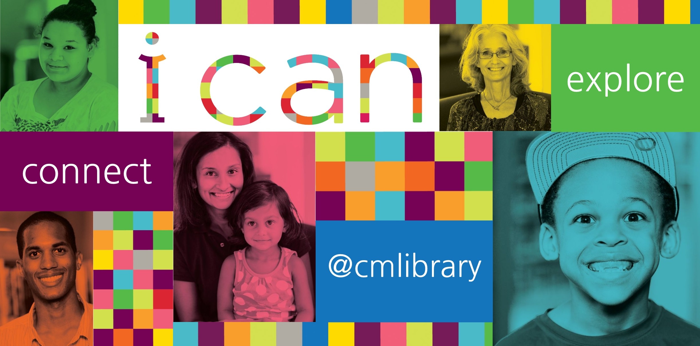

# CMLResource-Quizlet
  
  # Project Description
  * To create a dynamic coding quizlet focusing on connecting users with local public library resources in Charlotte, NC.

* This project applies HTMl, CSS, and Javascript applications. With the use of Javascript, we are able to assess user input through a series of questions and multiple choice scenarios. Based on the responses given, we can evaluate how the user performed and display their results on the final page.

# Demo Features:
* The following image and gif shows the web application's appearance and functionality:

# Live URL:
<a href="https://sjohn214.github.io/CMLResource-Quizlet/">CML Resource Quizlet Live</a>

<a href="https://github.com/sjohn214/CMLResource-Quizlet.git">CML Resource Quizlet GitHub Repo</a>

# Summary
* In this project a quizlet is created utilizing HTML, CSS, and Javascript. Javascript is used heavily to create the responsive questionnaire information.
* Javascript utilized created a dynamic visulization for the HTML documents.
* Pages appending to HTML.

# Special Features:
* Two HTML pages
  * Index.html
    * Landing page with a start timer, banner, and attribute for viewing scoring results.
    * Appends two pages.
* Highscores that uses local storage data from other page.
* CSS page containing 
  * style.css that is linked to the stylesheet on Index.html.
    * media queries styles
* Two Javascript pages
  * Variables
  * Arrays with objects
  * Multiple event listeners
  * Several if/else statements
  * For loops
  * Functions
  * Storage retrieval

# Authors
* Shannondale Page (student) <a href="https://github.com/sjohn214">Git Hub Profile</a>
* Austin Bruch (Bootcamp Instructor)
* Jon Jackson (Bootcamp TA Instructor)
* Daniel Sires (Bootcamp Tutor)